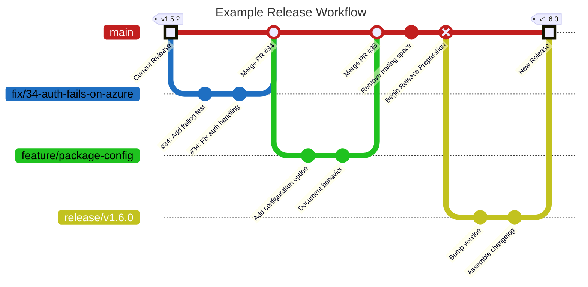

# Release Process

This repository follows a trunk-based development workflow with version-tagged releases. Most changes are integrated into `main` through short-lived topic branches. When a release is ready, a temporary release branch is created to prepare the release, validate the final changes, and provide a review gate before the release is merged back into `main` and tagged.

## Architecture

The release workflow consists of three phases:

- **Development**: Day-to-day work is performed on short-lived topic branches and merged into `main` through pull requests. Depending on the repository and the scope of the change, small maintenance updates may be committed directly to `main`.

- **Release Preparation**: When the changes accumulated on `main` are ready to be released, a temporary versioned release branch is created. This branch is used to perform release-specific tasks such as updating package versions, generating changelog entries, refreshing documentation, and validating the release before approval.

- **Release Publication**: Once the release branch has been approved and merged back into `main`, the release is published from the resulting release commit. This typically includes creating a version tag, publishing release notes, distributing build artifacts, generating checksums, and optionally publishing packages to configured registries.



## Workflow

### Development

For most user-facing changes, use a topic branch and a pull request.

1. Start from an up-to-date `main` branch.

    ```bash
    git checkout main
    git pull origin main
    git checkout -b feature/your-change-name
    ```

2. Work iteratively on the branch.
    - Make changes, updating tests, documentation, configuration, or metadata as needed.
    - When the changes should appear in the next release notes, add or update fragments under `changes/<change-id>/`. See [Changelog Fragments](changelog-fragments.md) for naming and writing guidance.
    - Make sure the repository Git hooks are installed so pre-commit runs on each commit, and fix any issues the hooks report.
    - Run pytest during development as needed.

3. Prepare the pull request.
    - Before opening the pull request, run the checks that match the scope of the change. For broad changes, run the full local checks:

        ```bash
        uv run pre-commit run --all-files
        uv run pytest
        ```

    - Open a pull request targeting `main`.
    - If the pull request changes during review, rerun the relevant checks before merging.

4. Merge the pull request once the applicable checks have passed and the review expectations have been satisfied.

> [!IMPORTANT]
> Avoid updating the package version or editing `CHANGELOG.md` during normal development. These files are updated during release preparation, and modifying them outside that process can create inconsistencies.

Small maintenance changes can be handled more directly when that fits the repository. For example, fixing a typo in internal documentation may not require the same pull request process as a user-facing behavior change.

### Release Preparation

> [!NOTE]
> A manually triggered `prepare-release` workflow is planned to automate this process. Until it is available, perform the following steps manually.

Once the accumulated changes on `main` are ready for release, begin the release-preparation process.

1. Choose the next version using Semantic Versioning.
    - **Patch** for backward-compatible bug fixes and small documentation-only release updates.
    - **Minor** for backward-compatible features or meaningful behavior improvements.
    - **Major** for breaking changes that require users or maintainers to adjust how they use the project.

2. Create a release branch from `main`.

    ```bash
    git checkout main
    git pull origin main
    git checkout -b release/vX.Y.Z
    ```

3. Update the package version with `uv version`. Use either an explicit version or a Semantic Versioning bump.

    ```bash
    uv version 1.6.0
    uv version --bump minor
    ```

    This updates the package metadata and keeps `uv.lock` in sync.

4. Compile the fragments under `changes/` into a new version section in `CHANGELOG.md`.

5. Remove the processed fragment files and directories from `changes/`.

6. Run the release-validation checks.

    ```bash
    uv run pre-commit run --all-files
    uv run pytest
    ```

7. Commit the release-preparation updates.

    ```bash
    git add pyproject.toml uv.lock CHANGELOG.md changes
    git commit -m "Prepare release vX.Y.Z"
    ```

8. Push the release branch.

    ```bash
    git push origin release/vX.Y.Z
    ```

9. Open a pull request targeting `main`.

#### Release Review

The release pull request acts as the final review and approval gate before publication. Use the review process to verify that the release metadata, documentation, changelog, and validation results accurately reflect the intended release.

Review the pull request for:

- The expected package version in `pyproject.toml`.
- The corresponding version update in `uv.lock`, with no unrelated lockfile changes.
- A correctly generated `CHANGELOG.md` section and appropriate comparison links.
- Accurate grouping and wording of changelog entries.
- Clear migration guidance for any breaking changes.
- Removal of only the fragments included in the current release.
- Successful CI runs and release-validation checks.

If additional changes are needed during review, commit them to the release branch and allow the pull request checks to run again. If the release should not proceed, close the pull request and delete the `release/vX.Y.Z` branch without creating the version tag.

Once the release has been approved and all required checks have passed, merge the pull request into `main`. The resulting commit on `main` becomes the release commit used during publication.
