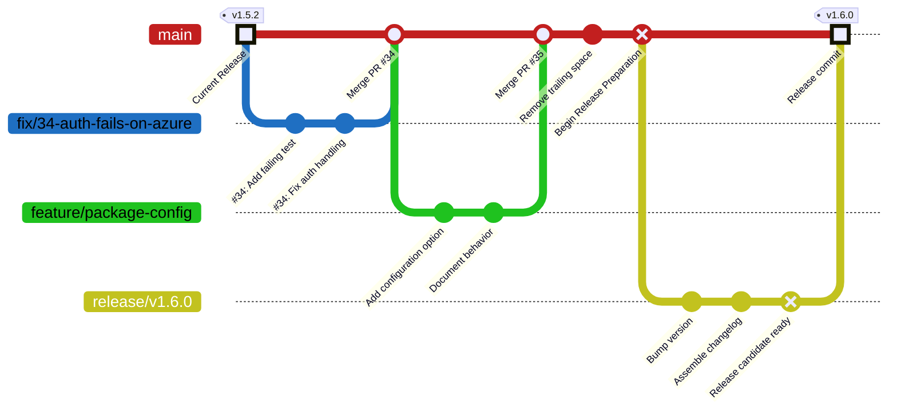

# Release Process

This repository follows a trunk-based development workflow with version-tagged releases. Most changes are integrated into `main` through short-lived topic branches. When a release is ready, a temporary release branch is created to prepare a release candidate, reviewed as a pull request, merged back into `main`, and published from the exact release commit.

## Architecture

The release workflow consists of four phases:

1. **Development**: Day-to-day work is performed on short-lived topic branches and merged into `main` through pull requests. Depending on the repository and the scope of the change, small maintenance updates may be committed directly to `main`.
2. **Preparation**: When the changes accumulated on `main` are ready to be released, a temporary versioned release branch is created. This branch is used to perform release-specific tasks such as updating package versions, generating changelog entries, refreshing documentation, and validating the release candidate.
3. **Review**: The release branch is reviewed as a pull request. This gate verifies the release contents, confirms that the branch still includes the current state of `main`, and either approves the release candidate or sends it back for another preparation pass.
4. **Publication**: Once the release pull request has been approved and merged back into `main`, the release is published from the exact resulting commit. This typically includes creating a version tag, generating release notes, distributing build artifacts, generating checksums, and optionally publishing packages to configured registries.

The following diagram shows an example release moving through development, preparation, review, and publication.



## Workflow

Follow these phases in order for each release. Development may happen continuously, but preparation, review, and publication should be performed for one release candidate at a time.

### 1. Development

For most user-facing changes, use a topic branch and a pull request.

1. Start from an up-to-date `main` branch.

    ```bash
    git switch main
    git pull --ff-only
    git switch -c feature/your-change-name
    ```

2. Work iteratively on the branch.
    - Make changes, updating tests, documentation, configuration, or metadata as needed.
    - When the changes should appear in the next release notes, add or update fragments under `changes/<change-id>/`. See [Changelog Fragments](changelog-fragments.md) for naming and writing guidance.
    - Make sure the repository Git hooks are installed so pre-commit runs on each commit, and fix any issues the hooks report.
    - Run pytest during development as needed.

3. Prepare the pull request.
    - Before opening the pull request, run the checks that match the scope of the change. For broad changes, run the full local checks:

        ```bash
        uv run pre-commit run --all-files
        uv run pytest
        ```

    - Open a pull request targeting `main`.
    - If the pull request changes during review, rerun the relevant checks before merging.

4. Merge the pull request once the applicable checks have passed and the review expectations have been satisfied.

> [!IMPORTANT]
> Avoid updating the package version or editing `CHANGELOG.md` during normal development. These files are updated during release preparation, and modifying them outside that process can create inconsistencies.

Small maintenance changes can be handled more directly when that fits the repository. For example, fixing a typo in internal documentation may not require the same pull request process as a user-facing behavior change.

### 2. Preparation

> [!NOTE]
> A manually triggered `prepare-release` workflow is planned to automate this process. Until it is available, perform the following steps manually.

Once the accumulated changes on `main` are ready for release, begin the release-preparation process.

1. Choose the next version using Semantic Versioning.
    - **Patch** for backward-compatible bug fixes and small documentation-only release updates.
    - **Minor** for backward-compatible features or meaningful behavior improvements.
    - **Major** for breaking changes that require users or maintainers to adjust how they use the project.

2. Create a release branch from `main`.

    ```bash
    git switch main
    git pull --ff-only
    git fetch origin --tags
    git switch -c release/vX.Y.Z
    ```

3. Update the package version with `uv version` as this will modify the version in `pyproject.toml` and keep `uv.lock` in sync. Use either an explicit version or a Semantic Versioning bump.

    ```bash
    uv version 1.6.0
    uv version --bump minor
    ```

4. Compile the fragments under `changes/` into a new version section in `CHANGELOG.md`.

5. Remove the processed fragment files and directories from `changes/`.

6. Run the release-validation checks.

    ```bash
    uv run pre-commit run --all-files
    uv run pytest
    ```

7. Commit the release-preparation updates.

    ```bash
    git add pyproject.toml uv.lock CHANGELOG.md changes
    git commit -m "Prepare release vX.Y.Z"
    ```

8. Push the release branch.

    ```bash
    git push -u origin release/vX.Y.Z
    ```

9. Open a release pull request targeting `main`.

### 3. Review

The release pull request is the final approval gate before publication. Use it to verify that the release candidate is complete, current, and ready to become the published version.

#### Release Contents

Check the pull request for:

- The expected package version in `pyproject.toml`.
- The corresponding version update in `uv.lock`, with no unrelated lockfile changes.
- A correctly generated `CHANGELOG.md` section and appropriate comparison links.
- Accurate grouping and wording of changelog entries.
- Clear migration guidance for any breaking changes.
- Removal of only the fragments included in the current release.
- Successful CI runs and release-validation checks.

#### Freshness Check

Before approving the release, verify that the release branch still contains the current state of `main`. This can often be checked directly from the pull request view. If that status is unclear or a local review is preferred, switch to the release branch and use the following command to count commits that are on `origin/main` but not on the release branch.

```bash
git fetch origin
git rev-list --count HEAD..origin/main
```

A result of `0` here indicates that the release branch contains the current `main`. A positive result means the release branch is behind `main` by that many commits.

#### Candidate Updates

If `main` has advanced, do not approve the stale release candidate. Either close the release pull request and prepare a new candidate later, or update the release branch so it includes the new commits from `main`.

To update the existing release branch from a local checkout, run:

```bash
git fetch origin
git switch release/vX.Y.Z
git merge origin/main
git push
```

After any update to the release branch, whether from incorporating `main` or applying release-specific review feedback, reassess the version selection, regenerate any affected changelog or documentation content, rerun the release-validation checks, and review the updated candidate again.

If the release should not proceed, close the pull request and delete the `release/vX.Y.Z` branch without creating the version tag.

#### Approval

Once the release candidate is current, approved, and passing required checks, merge the pull request into `main`. The commit that lands on `main` becomes the release commit used during publication, so record its SHA before moving on.

### 4. Publication

> [!NOTE]
> A `publish-release` workflow is planned to automate this process after the release pull request is merged. Until it is available, perform the following steps manually.

After the approved release pull request has been merged, the next step is to publish the release from the recorded release commit. The sections below verify that commit, tag it explicitly, build artifacts from the tag, and publish the release outputs.

#### Release Commit

The release commit is the boundary between review and publication. Before creating a tag or building artifacts, inspect the recorded commit and confirm that it contains the approved release-preparation updates for the intended version.

```bash
git fetch origin --tags
git show --stat --oneline <release-commit-sha>
```

The commit must also be reachable from `origin/main`, which confirms that the release pull request was merged before publication begins.

```bash
git merge-base --is-ancestor <release-commit-sha> origin/main
```

A zero exit code confirms the check passed. If the command fails, stop and verify that the pull request was merged as expected before publishing.

#### Version Tag

The version tag identifies the immutable source revision for the release. Create an annotated tag that points directly at the recorded release commit, then push the tag to the remote repository.

```bash
git tag -a vX.Y.Z <release-commit-sha> -m "Release vX.Y.Z"
git push origin vX.Y.Z
```

Specifying the commit explicitly prevents changes merged into `main` after the release pull request from being included in the release. After pushing the tag, check it out before building artifacts.

```bash
git checkout --detach vX.Y.Z
```

Building from the checked-out tag ensures that the source tree used to produce the artifacts exactly matches the source tree identified by the published version.

#### Release Artifacts

Build artifacts only after checking out the version tag. This keeps the source distribution, wheel, and checksums tied to the same source revision that users see in the published release.

```bash
uv build
```

The build should produce both a source distribution and a wheel under `dist/`. After the artifacts are present, generate SHA-256 checksums for them.

On Linux:

```bash
(
    cd dist
    sha256sum -- *.whl *.tar.gz > SHA256SUMS
)
```

On Windows with PowerShell 7:

```powershell
Get-ChildItem dist -File |
    Where-Object { $_.Name -ne "SHA256SUMS" } |
    Sort-Object Name |
    Get-FileHash -Algorithm SHA256 |
    ForEach-Object {
        "{0} *{1}" -f $_.Hash.ToLowerInvariant(), (Split-Path $_.Path -Leaf)
    } |
    Set-Content -Encoding UTF8 -Path dist/SHA256SUMS
```

#### GitHub Release

Create a GitHub Release for the version tag using the corresponding `CHANGELOG.md` section as the source for the release notes. Attach the source distribution, wheel, and `SHA256SUMS` file so the release page contains both the generated source archives and the built Python artifacts.

Before publishing the GitHub Release, confirm that the automatically generated source archives reference the expected version tag.

When the release workflow is automated, generate the GitHub Release notes from `CHANGELOG.md` instead of maintaining separate release-note text by hand.

#### Package Publication

If the package is distributed through a package index, publish the release artifacts to the configured target, such as PyPI or a private package registry.

> [!TIP]
> For PyPI publication, use Trusted Publishing after the project and repository have been configured for it. Trusted Publishing uses short-lived OpenID Connect credentials instead of requiring a long-lived PyPI API token.

#### Verification and Cleanup

After publication, verify the published release before deleting the temporary release branch.

- Confirm that the version tag references the intended release commit on `main`.
- Confirm that the GitHub Release contains the expected release notes and artifacts.
- Confirm that the published checksums match the attached artifacts.
- If applicable, confirm that the expected package version is available from the configured package index.

Delete the temporary release branch if it was not removed automatically after the pull request was merged.

```bash
git push origin --delete release/vX.Y.Z
git branch -d release/vX.Y.Z
```

If the pull request was squash-merged or rebased, Git may not recognize the local release branch as merged. After verifying that the release was published successfully, delete the local branch explicitly if needed.

```bash
git branch -D release/vX.Y.Z
```

> [!IMPORTANT]
> Once a GitHub Release or package has been published, do not move, recreate, or force-update its version tag. If a problem is discovered after publication, correct it through the normal development process and publish a new version.

The automated publication workflow should preserve the same boundary: it should publish from the merge commit or pushed version tag associated with the approved release pull request, not from whatever commit happens to be at the tip of `main` when the workflow runs.
