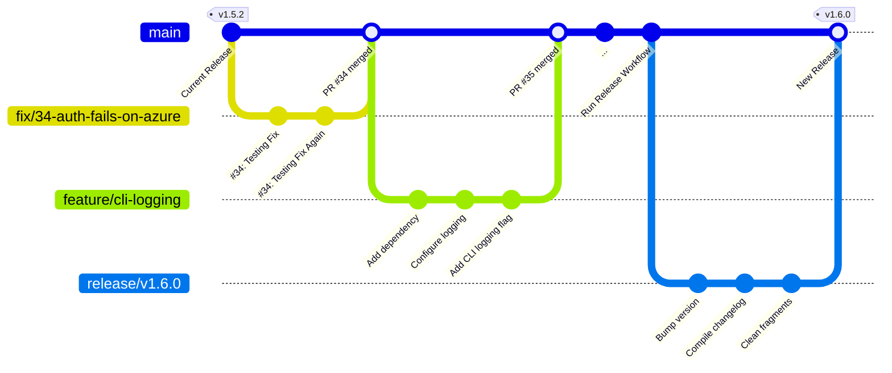

# Release Process

This document outlines the branching strategy, changelog aggregation model, and automated release pipeline for this repository.

## Architecture Overview

The architecture used is known as a trunk-based Git Tag Flow paired with an asynchronous Release Pull Request ("Stop & Wait") pattern. The following diagram illustrates the flow of changes from development to release:

## Branching Model

In general, the repository maintains three types of branches:

- **Trunk (`main`)**: Maintains production-ready code. All commits should enter `main` through approved Pull Requests. Direct pushes to `main` are generally prohibited by branch protection rules to ensure that all changes have been reviewed and validated by CI.
- **Topic Branches (`feature/*`, `fix/*`, etc.)**: Short-lived branches which are usually cut from `main` and focused on a single task. Once the work has been finished, everything gets merged back into the parent branch.
- **Release Branches (`release/vX.Y.Z`)**: Ephemeral staging branches generated automatically by the release preparation workflow. This is where the version bump, changelog compilation, and final validation occur before merging back into `main` and triggering the publishing workflow.
